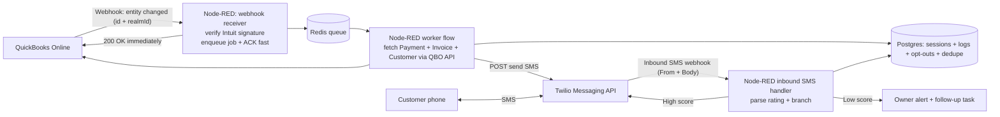

# Architecture

## Overview
This system uses Node-RED for orchestration, Redis for a lightweight queue, Postgres for state/logs, Twilio for SMS, and an LLM for complaint summaries. QBO webhooks are acknowledged quickly and processed asynchronously.

## Mermaid

## Key components
- Webhook receiver: validates Intuit signature, enqueues job, responds fast.
- Worker flow: fetches QBO entities, writes session + logs, triggers SMS.
- SMS handler: parses rating, handles opt-outs, branches to review or owner alert.
- Storage: Postgres for durable state and audit; Redis for queue and dedupe.

## Principles
- Idempotent at every hop.
- Minimal PII in logs.
- Compliance-first SMS handling.
- Observable with structured logs and event IDs.
